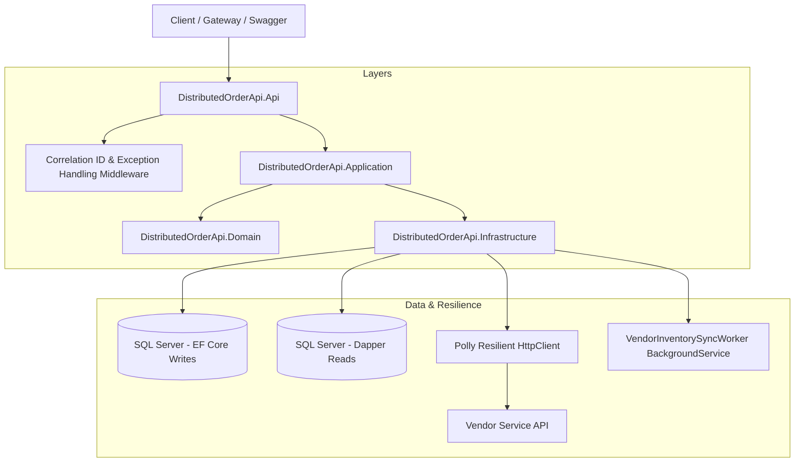

# 🚀 DistributedOrderApi

[](https://github.com/your-username/DistributedOrderApi/actions)


> **Production-Grade, Resilient C# / .NET 8 Microservice** built for enterprise e-commerce order processing. Showcasing Clean Architecture, CQRS with Dual ORM (EF Core + Dapper), Polly outbound HTTP resilience, background inventory sync workers, containerized deployment, and comprehensive automated test suites.

---

## 🏛 Architecture & Design Patterns

The architecture strictly follows **Clean Architecture (Domain-Driven Design)** principles, isolating core business logic from infrastructure frameworks and external web concerns.



### Key Architectural Highlights

1. **CQRS with Dual ORM Pattern**:
   - **Write Path (Command)**: Built with **Entity Framework Core 8**. Enforces domain invariants, entity encapsulation, owned value objects (`Money`, `Address`, `CustomerInfo`), and handles relational mapping for aggregate roots.
   - **Read Path (Query)**: Built with **Dapper**. Executes raw SQL queries optimized for zero-overhead projections, fast multi-map query execution, and database indexing support.

2. **Domain-Driven Design (DDD)**:
   - **Order Aggregate Root**: Encapsulates status state machine transitions (`Draft` ➔ `Submitted` ➔ `Processing` ➔ `Completed` / `Cancelled`).
   - **Value Objects**: Immutable `Money`, `Address`, and `CustomerInfo` types.
   - **Domain Events**: Dispatches domain lifecycle events (`OrderCreatedDomainEvent`, `OrderStatusChangedDomainEvent`).

3. **Outbound Resiliency (Polly Integration)**:
   - External vendor stock verification and catalog fetch operations are wrapped with **Polly Resilience Pipelines**:
     - Exponential Backoff Retry (3 attempts with jitter).
     - Circuit Breaker policy (opens after 5 consecutive failures for 30s recovery).

4. **Background Worker Processing**:
   - `VendorInventorySyncWorker` utilizes .NET `BackgroundService` (`IHostedService`) to execute periodic inventory sync loops with vendor catalogs without blocking API throughput.

5. **Cross-Cutting Enterprise Concerns**:
   - **Structured Logging**: Serilog configured with Compact JSON formatting and HTTP log context.
   - **Traceability**: `CorrelationIdMiddleware` propagates and injects `X-Correlation-ID` headers across request contexts.
   - **Error Handling**: RFC 7807 `ProblemDetails` standard exception formatting.
   - **API Versioning**: `Asp.Versioning.Mvc` with OpenAPI Swashbuckle UI.
   - **Health Monitoring**: Standard `/health`, `/health/ready`, and `/health/live` endpoints inspecting EF Core database context and SQL Server connections.

---

## 📂 Project Structure

```text
DistributedOrderApi/
├── DistributedOrderApi.sln
├── src/
│   ├── DistributedOrderApi.Domain/        # Aggregates, Entities, Value Objects, Domain Events, Enums
│   ├── DistributedOrderApi.Application/   # CQRS Commands, Queries, DTOs, FluentValidation, Interfaces
│   ├── DistributedOrderApi.Infrastructure/ # EF Core DbContext, Dapper Repos, Polly HTTP Client, Workers
│   └── DistributedOrderApi.Api/            # ASP.NET Core Web API, Controllers, Middleware, Health Checks
├── tests/
│   ├── DistributedOrderApi.UnitTests/     # Domain Aggregate & Command Handler unit tests (xUnit, Moq)
│   └── DistributedOrderApi.IntegrationTests/ # WebApplicationFactory & In-Memory integration tests
├── docker-compose.yml                     # SQL Server 2022, Redis, LocalStack & API multi-container setup
├── Dockerfile                             # Multi-stage optimized production docker build
├── .github/workflows/ci.yml               # GitHub Actions CI workflow (restore, build, test, docker)
└── README.md
```

---

## 🚦 Getting Started

### Prerequisites
- [.NET 8.0 SDK](https://dotnet.microsoft.com/download/dotnet/8.0)
- [Docker Desktop](https://www.docker.com/products/docker-desktop/) (for containerized execution & SQL Server)

### 🛠 Local Setup & Running via Docker Compose

1. **Clone Repository**:
   ```bash
   git clone https://github.com/your-username/DistributedOrderApi.git
   cd DistributedOrderApi
   ```

2. **Launch Infrastructure Services (SQL Server, Redis, LocalStack, API)**:
   ```bash
   docker-compose up -d --build
   ```

3. **Access Interactive Swagger API Documentation**:
   Navigate to [http://localhost:8080](http://localhost:8080) in your browser to inspect and interact with the endpoints.

---

## 🧪 Running Automated Tests

Run all unit and integration tests using the .NET CLI:

```bash
# Run unit tests
dotnet test tests/DistributedOrderApi.UnitTests/DistributedOrderApi.UnitTests.csproj

# Run integration tests
dotnet test tests/DistributedOrderApi.IntegrationTests/DistributedOrderApi.IntegrationTests.csproj
```

---

## ☁️ Deployment Target (AWS ECS / Fargate)

This application is designed for cloud-native containerized hosting on **AWS ECS with Fargate**:
- Multi-stage `Dockerfile` produces a slim runtime image targeting `mcr.microsoft.com/dotnet/aspnet:8.0`.
- Includes non-root security context (`appuser`) for cloud compliance.
- Integrates health check probes (`/health/live`, `/health/ready`) ready for AWS Application Load Balancer (ALB) target group integration.

---

## 📜 License

Distributed under the MIT License.
