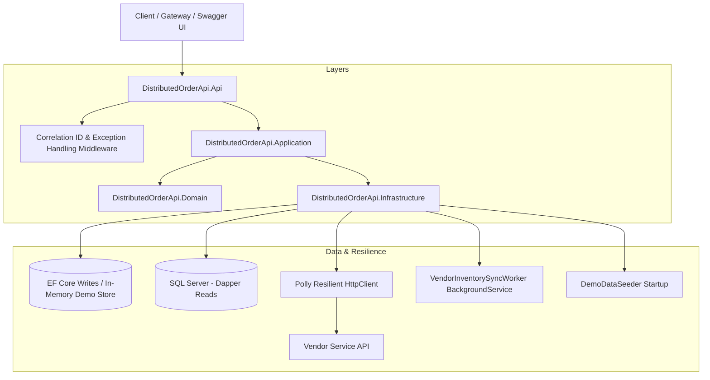

# 🚀 DistributedOrderApi

[](https://github.com/AliceOnTheSea/DistributedOrderApi/actions)


> **Production-Grade, Resilient C# / .NET 8 Microservice** built for enterprise e-commerce order processing. Showcasing Clean Architecture, CQRS with Dual ORM (EF Core + Dapper), Polly outbound HTTP resilience, background inventory sync workers, containerized deployment, standalone in-memory demo fallback, and comprehensive automated test suites.

---

## 🏛 Architecture & Design Patterns

The architecture strictly follows **Clean Architecture (Domain-Driven Design)** principles, isolating core business logic from infrastructure frameworks and external web concerns.


```mermaid
graph TD
    Client[Client / Gateway / Swagger UI] --> API[DistributedOrderApi.Api]
    
    subgraph Layers
        API --> Middleware[Correlation ID & Exception Handling Middleware]
        API --> App[DistributedOrderApi.Application]
        App --> Domain[DistributedOrderApi.Domain]
        App --> Infra[DistributedOrderApi.Infrastructure]
    end

    subgraph Data & Resilience
        Infra --> EFCore[(EF Core Writes / In-Memory Demo Store)]
        Infra --> Dapper[(SQL Server - Dapper Reads)]
        Infra --> Polly[Polly Resilient HttpClient]
        Polly --> External[Vendor Service API]
        Infra --> Worker[VendorInventorySyncWorker BackgroundService]
        Infra --> Seeder[DemoDataSeeder Startup]
    end
```

### Key Architectural Highlights

1. **CQRS with Dual ORM Pattern**:
   - **Write Path (Command)**: Built with **Entity Framework Core 8**. Enforces domain invariants, entity encapsulation, owned value objects (`Money`, `Address`, `CustomerInfo`), and handles relational mapping for aggregate roots.
   - **Read Path (Query)**: Built with **Dapper** in production SQL Server mode, falling back seamlessly to an EF-projected read repository in standalone Demo / In-Memory mode.

2. **Domain-Driven Design (DDD)**:
   - **Order Aggregate Root**: Encapsulates status state machine transitions (`Draft` ➔ `Submitted` ➔ `Processing` ➔ `Completed` / `Cancelled`).
   - **Value Objects**: Immutable `Money`, `Address`, and `CustomerInfo` types.
   - **Domain Events**: Dispatches domain lifecycle events (`OrderCreatedDomainEvent`, `OrderStatusChangedDomainEvent`).

3. **Standalone Demo & In-Memory Mode**:
   - When `DemoMode=true` or `UseInMemoryDatabase=true` is set (e.g., for free-tier cloud hosting), the infrastructure layer automatically switches to EF Core In-Memory database with [`InMemoryOrderReadRepository`](file:///Users/alicec/.gemini/antigravity-ide/scratch/DistributedOrderApi/src/DistributedOrderApi.Infrastructure/Persistence/Repositories/InMemoryOrderReadRepository.cs) and seeds deterministic DDD sample order data on startup via [`DemoDataSeeder`](file:///Users/alicec/.gemini/antigravity-ide/scratch/DistributedOrderApi/src/DistributedOrderApi.Infrastructure/Persistence/DemoDataSeeder.cs).

4. **Outbound Resiliency (Polly Integration)**:
   - External vendor stock verification and catalog fetch operations are wrapped with **Polly Resilience Pipelines**:
     - Exponential Backoff Retry (3 attempts with jitter).
     - Circuit Breaker policy (opens after 5 consecutive failures for 30s recovery).

5. **Background Worker Processing**:
   - `VendorInventorySyncWorker` utilizes .NET `BackgroundService` (`IHostedService`) to execute periodic inventory sync loops with vendor catalogs without blocking API throughput.

6. **Cross-Cutting Enterprise Concerns**:
   - **Structured Logging**: Serilog configured with Compact JSON formatting and HTTP log context.
   - **Traceability**: `CorrelationIdMiddleware` propagates and injects `X-Correlation-ID` headers across request contexts.
   - **Error Handling**: RFC 7807 `ProblemDetails` standard exception formatting.
   - **API Versioning**: `Asp.Versioning.Mvc` with OpenAPI Swashbuckle UI served directly at root (`/`) in demo mode.
   - **Health Monitoring**: Standard `/health`, `/health/ready`, and `/health/live` endpoints.

---

## 📂 Project Structure

```text
DistributedOrderApi/
├── DistributedOrderApi.sln
├── render.yaml                            # Render Blueprint for zero-dependency web service deployment
├── Dockerfile                             # Multi-stage optimized production docker build
├── docker-compose.yml                     # SQL Server 2022, Redis, LocalStack & API multi-container setup
├── src/
│   ├── DistributedOrderApi.Domain/        # Aggregates, Entities, Value Objects, Domain Events, Enums
│   ├── DistributedOrderApi.Application/   # CQRS Commands, Queries, DTOs, FluentValidation, Interfaces
│   ├── DistributedOrderApi.Infrastructure/ # EF Core DbContext, Dapper/InMemory Repos, DemoSeeder, Workers
│   └── DistributedOrderApi.Api/            # ASP.NET Core Web API, Dynamic $PORT Binding, Middleware
├── tests/
│   ├── DistributedOrderApi.UnitTests/     # Domain Aggregate & Command Handler unit tests (xUnit, Moq)
│   └── DistributedOrderApi.IntegrationTests/ # WebApplicationFactory & In-Memory integration tests
├── .github/workflows/ci.yml               # GitHub Actions CI workflow (restore, build, test, docker)
└── README.md
```

---

## 🔌 Core API Endpoints (v1)

| Method | Endpoint | Description | Pattern / Layer |
| :--- | :--- | :--- | :--- |
| `POST` | `/api/v1/orders` | Create a new order with stock validation | EF Core Command + Polly Vendor Check |
| `GET` | `/api/v1/orders/{id}` | Retrieve order details & line items | Dapper / InMemory Read Projection |
| `PATCH` | `/api/v1/orders/{id}/status` | Transition order state machine | DDD Aggregate Root Invariants |
| `GET` | `/health/ready` | Readiness probe (SQL Server / EF Context) | AWS ALB / Render Target Group Health Check |

---

## 🚦 Getting Started

### Prerequisites
- [.NET 8.0 SDK](https://dotnet.microsoft.com/download/dotnet/8.0)
- [Docker Desktop](https://www.docker.com/products/docker-desktop/) (for containerized execution & SQL Server)

### 🛠 Local Setup & Running via Docker Compose

1. **Clone Repository**:
   ```bash
   git clone https://github.com/AliceOnTheSea/DistributedOrderApi.git
   cd DistributedOrderApi
   ```

2. **Launch Infrastructure Services (SQL Server, Redis, LocalStack, API)**:
   ```bash
   docker-compose up -d --build
   ```

3. **Access Interactive Swagger API Documentation**:
   Navigate to [http://localhost:8080](http://localhost:8080) in your browser to inspect and interact with the endpoints.

---

## 🧪 Running Automated Tests

Run all unit and integration tests using the .NET CLI:

```bash
# Run unit tests
dotnet test tests/DistributedOrderApi.UnitTests/DistributedOrderApi.UnitTests.csproj

# Run integration tests
dotnet test tests/DistributedOrderApi.IntegrationTests/DistributedOrderApi.IntegrationTests.csproj
```

---

## ☁️ Render Web Service Deployment

This project includes full support for deploying as a standalone, free-tier Docker Web Service on **Render** (within 512 MB RAM limits):

1. **Blueprint Support**: Uses [`render.yaml`](file:///Users/alicec/.gemini/antigravity-ide/scratch/DistributedOrderApi/render.yaml) for automated Render deployment.
2. **Environment Configuration**:
   - `ASPNETCORE_ENVIRONMENT`: `Production`
   - `DemoMode`: `true`
   - `UseInMemoryDatabase`: `true`
3. **Dynamic Port Binding**: Kestrel automatically binds to Render's `$PORT` environment variable (listening on `0.0.0.0:$PORT`).
4. **Root Swagger UI**: Interactive Swagger documentation is served at `/` (`http://your-app.onrender.com/`).
5. **Seeded Orders**: Pre-loaded with seeded orders illustrating DDD state transitions:
   - **Submitted**: `11111111-1111-1111-1111-111111111111`
   - **Processing**: `22222222-2222-2222-2222-222222222222`
   - **Completed**: `33333333-3333-3333-3333-333333333333`

---

## ☁️ AWS Deployment Target (ECS / Fargate)

This application is also ready for enterprise cloud hosting on **AWS ECS with Fargate**:
- Multi-stage `Dockerfile` produces a slim runtime image targeting `mcr.microsoft.com/dotnet/aspnet:8.0`.
- Includes non-root security context (`appuser`) for cloud compliance.
- Integrates health check probes (`/health/live`, `/health/ready`) ready for AWS Application Load Balancer (ALB) target group integration.

---

## 📜 License

Distributed under the MIT License.
